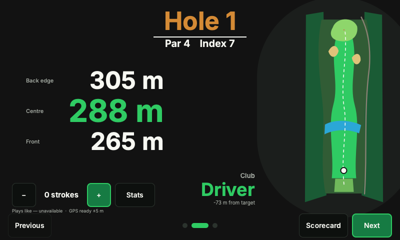

# OpenCaddie

OpenCaddie is an open-source, local-first golf computer for Raspberry Pi. It
combines offline course maps from [OpenGolfMap](https://github.com/magnus188/OpenGolfMap),
live GNSS distances, scorekeeping, round history, a configurable golf bag, and
on-device Wi-Fi management in a touch-first 800×480 interface.

> Status: V1 developer preview. The domain, storage, course-package, hardware
> abstraction, simulator, and device UI are implemented. Hardware endurance and
> outdoor-display qualification remain release gates.




## Technology

- C++20, Qt 6.8 LTS / Qt Quick Controls and QML
- SQLite in WAL mode with full synchronous commits
- NetworkManager over D-Bus, gpsd, Qt Network and Qt SVG
- Raspberry Pi OS Lite 64-bit with DRM/KMS EGLFS
- Raspberry Pi 5 development target; wireless 16 GB Compute Module Zero
  production target

## Build and run the simulator

Qt 6.8+, CMake 3.24+, Ninja, and a C++20 compiler are required.

```sh
cmake --preset desktop
cmake --build --preset desktop --parallel
ctest --preset desktop
cmake --build build/desktop --target opencaddie_qmllint
./build/desktop/bin/OpenCaddie.app/Contents/MacOS/OpenCaddie --simulate --windowed
```

On Linux, the executable is `build/desktop/bin/OpenCaddie`. The simulator uses
mock Wi-Fi/power providers, an embedded semantic course, and a recorded GPS
route. Pass `--route path/to/route.csv` to replay another route.

Create an optimized archive with:

```sh
cmake --preset release
cmake --build --preset release --parallel
ctest --preset release
cpack --preset release
```

## Device run

```sh
QT_QPA_PLATFORM=eglfs \
QT_QPA_EGLFS_INTEGRATION=eglfs_kms \
/usr/bin/OpenCaddie --device --data-dir /var/lib/opencaddie
```

The production service definition is in
`packaging/systemd/opencaddie.service`. Course packages live under
`/var/lib/opencaddie/courses/<slug>/<version>/`; user entities and migrations
live in `user.sqlite`. Wi-Fi secrets are never persisted by OpenCaddie.

## Repository layout

- `src/domain`: scoring, Stableford, units, geometry, GPS validity, hole selection
- `src/storage`: migrations and repositories for profiles, clubs, courses, rounds
- `src/courses`: OpenGolfMap client and verified atomic course installation
- `src/positioning`: gpsd, route replay, and manual providers
- `src/connectivity`: NetworkManager D-Bus and desktop mock
- `src/platform`: power/brightness boundary
- `src/ui`: QML application, semantic course renderer, translations
- `docs`: architecture, hardware, data licensing, security and V2 boundaries

## Data and licensing

OpenCaddie is licensed under
`AGPL-3.0-or-later`. Inter is bundled under the SIL Open Font License. Source
code from OpenGolfMap is Apache-2.0; OSM-derived course data and produced
databases remain subject to ODbL. Attribution is retained in course metadata
and exports. See [third-party notices](docs/third-party.md).

## Contributing

Read [CONTRIBUTING.md](CONTRIBUTING.md), the
[architecture](docs/architecture.md), and [security policy](SECURITY.md).
Please keep device features usable without internet after a course download.
