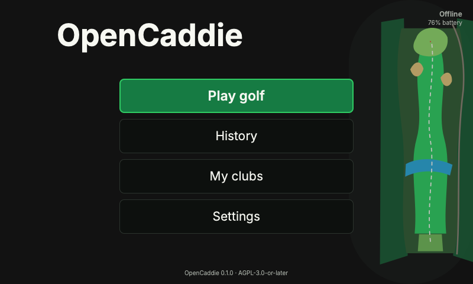
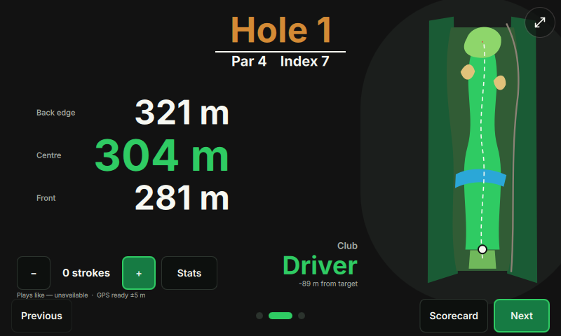
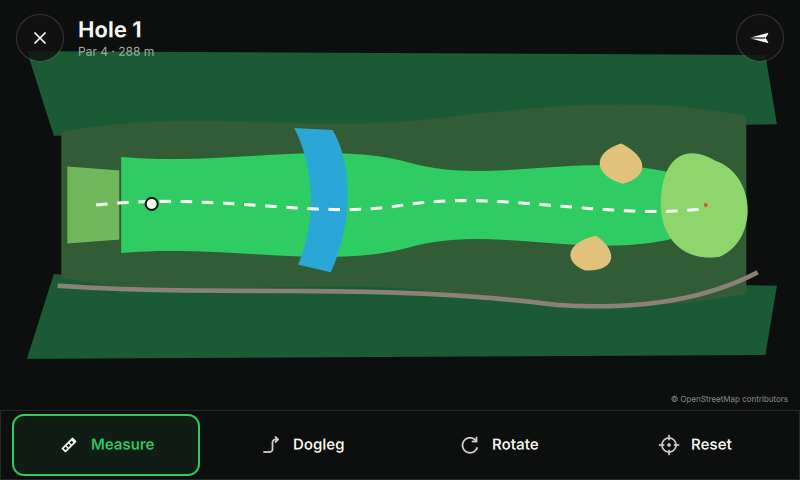
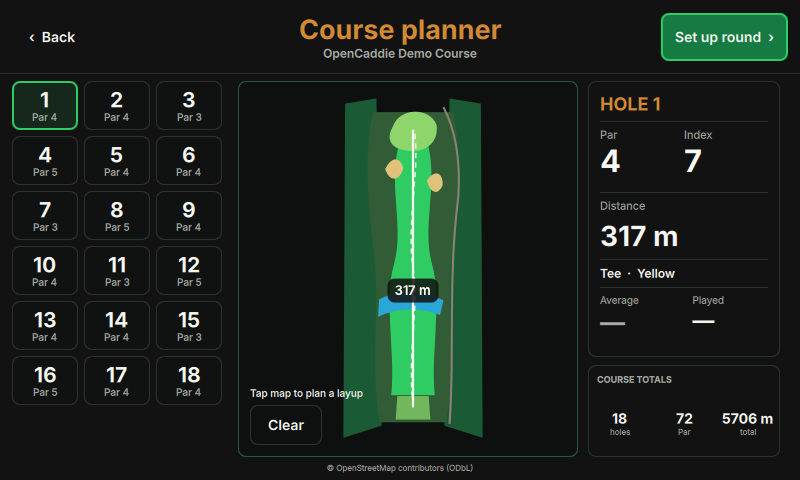

# OpenCaddie

OpenCaddie is an open-source, local-first golf computer for Raspberry Pi. It
combines offline course maps from [OpenGolfMap](https://github.com/magnus188/OpenGolfMap),
pre-round course analysis with reusable tap-to-measure layups, live GNSS distances,
scorekeeping, round history, a configurable golf bag, and on-device Wi-Fi
management in a touch-first 800×480 interface. Completed rounds
feed local overall/per-course statistics, scoring trends, accuracy summaries,
weather provenance, and recorded-shot milestones.

## Optional stroke tracking

During a round, tap **Record stroke** after walking to the ball, then tap the
club image used for the shot. Choosing **Record without club** keeps club
selection optional. OpenCaddie uses only a fresh GPS fix (10 seconds old or less
and within 25 m accuracy), records the club and landing locally, increments the
editable score, and adds the shot to both hole maps. If no usable fix is
available, the tap still records an **Unknown** stroke and increments the score
without inventing a position or distance.

Drive, approach, chip, and putt labels are best-effort inferences from stroke
order, the selected tee, and green geometry. The latest recorded stroke can be
retyped with large type buttons or undone immediately, while the normal score
screen remains the source of truth for missed taps, penalties, and other manual
corrections. Tracking is entirely optional: it never blocks hole navigation or
round completion. Round and statistics screens show “tracked · scored” coverage
so partial tracking is not presented as a complete shot history.

> Status: V1 developer preview. The domain, storage, course-package, hardware
> abstraction, simulator, and device UI are implemented. Hardware endurance and
> outdoor-display qualification remain release gates.









## Technology

- C++20, Qt 6.8 LTS / Qt Quick Controls and QML
- SQLite in WAL mode with full synchronous commits
- NetworkManager over D-Bus, gpsd, Qt Network and Qt SVG
- Raspberry Pi OS Lite 64-bit with DRM/KMS EGLFS
- Raspberry Pi 5 development target; wireless 16 GB Compute Module Zero
  production target

## Build and run the simulator

Qt 6.8+, CMake 3.24+, Ninja, and a C++20 compiler are required.

The shortest way to run the app is:

```sh
make simulation
make simulated-round
```

Use `make simulation LANGUAGE=nb` for Norwegian. `make help` lists the
available development commands. To open a specific view while iterating, use
`make screen SCREEN=StatsScreen`.

```sh
cmake --preset desktop
cmake --build --preset desktop --parallel
ctest --preset desktop
cmake --build build/desktop --target opencaddie_qmllint
./build/desktop/bin/OpenCaddie.app/Contents/MacOS/OpenCaddie --simulate --windowed
```

OpenGolfMap is self-hosted. Start the service from the sibling OpenGolfMap
repository, then search and download courses from **Courses**:

```sh
cd ../OpenGolfMap
npm install
npm run dev

cd ../Golfcomputer
./build/desktop/bin/OpenCaddie.app/Contents/MacOS/OpenCaddie \
  --simulate --windowed --opengolfmap-url http://localhost:3000
```

For a deployed service, use an HTTPS origin with `--opengolfmap-url`, set
`OPENCADDIE_OPENGOLFMAP_URL`, or edit the server under **Settings → Connectivity
and storage**. The API is only needed to search and download a course; map
graphics, navigation, zoom, measurement, and dogleg planning use the verified
offline bundle during a round.

On Linux, the executable is `build/desktop/bin/OpenCaddie`. The simulator uses
mock Wi-Fi/power providers, an embedded semantic course, and a recorded GPS
route. Pass `--route path/to/route.csv` to replay another route.

Create an optimized archive with:

```sh
cmake --preset release
cmake --build --preset release --parallel
ctest --preset release
cpack --preset release
```

## Device run

```sh
QT_QPA_PLATFORM=eglfs \
QT_QPA_EGLFS_INTEGRATION=eglfs_kms \
/usr/bin/OpenCaddie --device --data-dir /var/lib/opencaddie
```

The production service definition is in
`packaging/systemd/opencaddie.service`. Course packages live under
`/var/lib/opencaddie/courses/<slug>/<version>/`; user entities and migrations
live in `user.sqlite`. Wi-Fi secrets are never persisted by OpenCaddie.

## Repository layout

- `src/domain`: scoring, Stableford, units, geometry, GPS validity, hole and stroke classification
- `src/storage`: migrations and repositories for profiles, clubs, courses, rounds
- `src/courses`: OpenGolfMap client and verified atomic course installation
- `src/positioning`: gpsd, route replay, and manual providers
- `src/connectivity`: NetworkManager D-Bus and desktop mock
- `src/integrations`: canonical external-data capabilities and provider catalog
- `src/platform`: power/brightness boundary
- `src/ui`: QML application, semantic course renderer, translations
- `docs`: architecture, hardware, data licensing, security and V2 boundaries

## Data and licensing

OpenCaddie is licensed under
`AGPL-3.0-or-later`. Inter is bundled under the SIL Open Font License. Source
code from OpenGolfMap is Apache-2.0; OSM-derived course data and produced
databases remain subject to ODbL. Attribution is retained in course metadata
and exports. See [third-party notices](docs/third-party.md).

## Contributing

Read [CONTRIBUTING.md](CONTRIBUTING.md), the
[architecture](docs/architecture.md), [integration feasibility review](docs/integrations.md),
and [security policy](SECURITY.md).
Please keep device features usable without internet after a course download.
