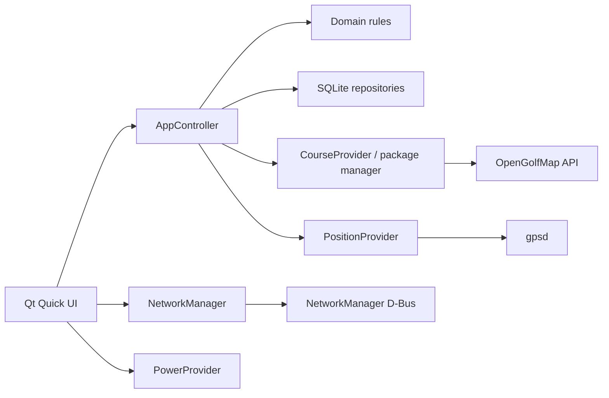

# Architecture

OpenCaddie is a local-first application. The domain layer has no Qt dependency;
device services depend inward on domain types, and QML talks to them through a
small controller API.

## Persistence

SQLite uses WAL, foreign keys, `synchronous=FULL`, and versioned migrations.
Every score edit commits before the UI reports success. `rounds.current_hole`
makes an unfinished round resumable after reboot. Participants and an outbox are
present in V1 so multiplayer and sync do not require destructive schema changes.

## Course packages

Manifest schema v2 is the device contract. Packages must include semantic
`render-model.json`, `navigation.json`, ODbL attribution, and per-asset SHA-256
and byte sizes. Installation extracts into a sibling staging directory, validates
every required asset, then renames the completed version atomically.

## Positioning

WGS84 positions are transformed through the per-hole local origin and rotation.
Club advice is hidden for invalid fixes, fixes older than ten seconds, or
accuracy worse than 25 m. Automatic hole selection uses distance hysteresis.
No slope, weather, or “plays like” value is invented.

## Extension boundaries

See [V2 design](v2-extension-path.md). OpenFlight is intentionally outside the
current architecture decision record.

