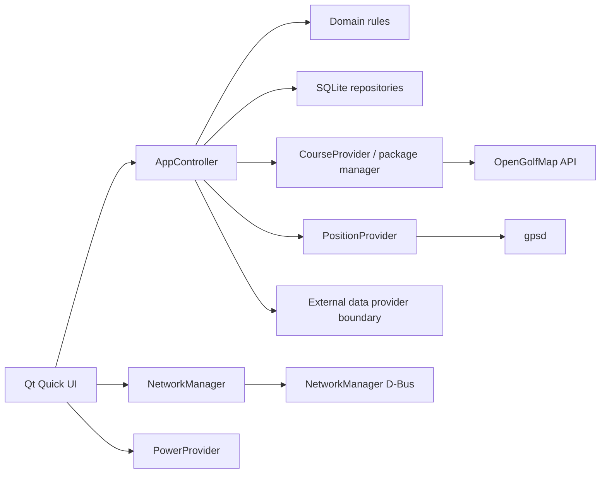

# Architecture

OpenCaddie is a local-first application. The domain layer has no Qt dependency;
device services depend inward on domain types, and QML talks to them through a
small controller API.

## Persistence

SQLite uses WAL, foreign keys, `synchronous=FULL`, and versioned migrations.
Every score edit commits before the UI reports success. `rounds.current_hole`
makes an unfinished round resumable after reboot. Participants and an outbox are
present in V1 so multiplayer and sync do not require destructive schema changes.

Schema v2 adds weather snapshots with provenance, canonical shot records, safe
integration-account status (no credentials), and external-round identities.
Schema v3 adds extensible canonical and source-unit launch-monitor metrics.
Schema v4 enforces shot/participant/round identity and adds statistics indexes.
Schema v5 persists the 9/18-hole handicap index scale so historical Stableford
points cannot change as additional holes are entered, and enforces score
participant/round identity.
Schema v6 persists per-hole course-analysis routes and snapshots selected routes
into a round. This keeps an active round independent from later analysis edits.
Optional stroke tracking reuses the canonical `shots` table. Append, latest-shot
undo, and latest-shot type correction update the owner score and putt count in
the same transaction. Those operations change only strokes/putts and retain
penalties, fairway/GIR, tee, notes, and manual score corrections. A failed
transaction changes neither side. The club picker stores the selected club ID
and a name snapshot on the shot; choosing no club leaves both fields empty and
does not alter the tracking transaction.
Statistics are projections rebuilt from owner-participant scores and shots.
Nine-hole and partially scored results are normalized by recorded holes when
shown on an 18-hole trend, but only when every scored hole has valid par
metadata. A longest drive is never inferred from a scorecard.

## Course packages

Manifest schema v2 is the device contract. Packages must include semantic
`render-model.json`, `navigation.json`, ODbL attribution, and per-asset SHA-256
and byte sizes. Installation extracts into a sibling staging directory, validates
every required asset, then renames the completed version atomically.

## Positioning

WGS84 positions are transformed through the per-hole local origin and rotation.
Club advice is hidden for invalid fixes, fixes older than ten seconds, or
accuracy worse than 25 m. Automatic hole selection uses distance hysteresis.
No slope, weather, or “plays like” value is invented.

The same fresh-fix rule applies to stroke tracking. The first start point must
come from the round's exactly selected tee; later starts may use only the prior
recorded landing. A missing fix is stored as a locationless `unknown` stroke,
and score/trail continuity is deliberately not synthesized across missed or
manually entered strokes. Stroke categories are best-effort projections and the
latest local category remains editable.

## Extension boundaries

See the [external integration review](integrations.md) and
[V2 design](v2-extension-path.md). OpenFlight is intentionally outside the
current architecture decision record.
